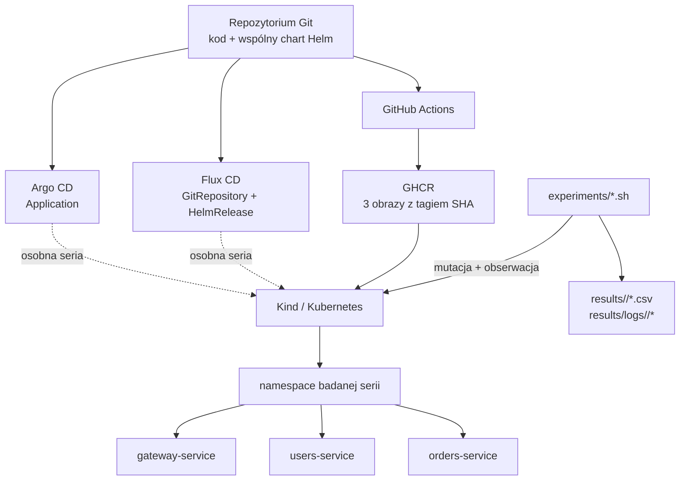

# Argo CD vs Flux CD — środowisko badawcze GitOps

Kompletny, celowo lekki projekt do pracy magisterskiej poświęconej analizie
automatyzacji wdrożeń aplikacji mikroserwisowej w Kubernetes z użyciem Argo CD i
Flux CD. Repozytorium dostarcza tę samą aplikację, obrazy i chart Helm dla obu
narzędzi oraz powtarzalne scenariusze mierzące synchronizację, self-healing,
drift, recovery, rollback i zużycie zasobów.

Projekt nie jest przykładem rozbudowanej domeny biznesowej. Jego produktem są
kontrolowane zmiany, surowe wyniki CSV i diagnostyka pozwalająca obronić sposób
pomiaru.

## Architektura



Argo CD i Flux CD nie powinny jednocześnie zarządzać tym samym wydaniem.
Oddzielne namespace (`test-argocd`, `test-fluxcd`) są wygodne w pilotażu, ale
wyniki właściwe należy zbierać po resecie klastra pomiędzy seriami. Szczegółowe
uzasadnienie znajduje się w [metodyce](docs/methodology.md).

## Co zawiera repozytorium

```text
.
├── .github/workflows/       # test/build/push oraz niezależny lint
├── analysis/                # statystyki CSV i testy analizatora
├── app/
│   ├── common/              # wspólna fabryka FastAPI
│   ├── gateway-service/     # osobny entrypoint, zależności i obraz
│   ├── users-service/
│   └── orders-service/
├── docs/                    # dokumentacja techniczna i metodyka
├── experiments/
│   ├── lib/                 # wspólny pomiar, Git i bezpieczny edytor values
│   └── *.sh                 # scenariusze badawcze i smoke test
├── gitops/
│   ├── argocd/              # Application
│   └── fluxcd/              # GitRepository + HelmRelease
├── helm/microservices-app/  # jeden wspólny chart
├── results/                 # generowane CSV/logi (ignorowane przez Git)
├── scripts/                 # Kind, kontrolery, metrics i cleanup
├── tests/                   # testy API
├── docker-compose.yml
├── IMPLEMENTATION_PLAN.md
└── Makefile
```

## Wymagania

Do pełnego odtworzenia potrzebne są:

- Git i Bash (Linux/macOS, WSL albo Git Bash);
- Python 3.12+;
- Docker z działającym daemonem i Docker Compose v2;
- kind;
- kubectl;
- Helm 3;
- publiczne repozytorium Git dostępne dla kontrolera albo skonfigurowane poza
  repo poświadczenia do repo prywatnego;
- konto GitHub z możliwością publikacji obrazów do GHCR.

Opcjonalnie: `ruff`, `yamllint`, `matplotlib` i klient `argocd`/`flux`. Skrypty
instalacyjne nie wymagają klientów Argo/Flux, ponieważ korzystają z `kubectl`.

Sprawdzenie podstawowego zestawu:

```bash
./scripts/check-requirements.sh
```

Makefile wywołuje skrypty przez `bash`, więc nie zależy od lokalnego bitu
wykonywalności. Przy pierwszym commicie tworzonym na Windows warto zachować tryb
skryptów dla późniejszych checkoutów Linux/macOS:

```bash
git add --chmod=+x scripts/*.sh experiments/*.sh
```

Wersje kontrolerów i komponentów są przypięte w skryptach: Argo CD v3.5.0,
Flux v2.9.3, Metrics Server v0.7.2; workflow lint używa Helm v3.18.6. Kind używa
domyślnie Kubernetes v1.33.4 przypiętego digestem. Jeżeli nadpisujesz
`KIND_NODE_IMAGE`, użyj pełnego `tag@sha256:digest` i tej samej wartości w obu
seriach.

## Szybki test aplikacji bez Kubernetes

```bash
python3 -m pip install -r requirements-dev.txt
python3 -m pytest tests analysis

docker compose up --build --wait -d
curl http://localhost:8000/health
curl http://localhost:8000/ready
curl http://localhost:8000/version
curl http://localhost:8001/version
curl http://localhost:8002/version
docker compose down
```

Odpowiedź `/version` ma postać:

```json
{
  "service": "gateway-service",
  "version": "1.0.0",
  "hostname": "..."
}
```

`APP_FAILURE_MODE=readiness` wywołuje deterministyczne HTTP 503 na `/ready`, a
`APP_FAILURE_MODE=http` dodatkowo HTTP 500 na `/`. Opis API i testów:
[docs/application.md](docs/application.md).

## Obrazy i pierwsza konfiguracja GHCR

Workflow publikuje przy pushu do `main`:

```text
ghcr.io/<github-owner-lowercase>/gateway-service:<git-sha>
ghcr.io/<github-owner-lowercase>/users-service:<git-sha>
ghcr.io/<github-owner-lowercase>/orders-service:<git-sha>
```

Po pierwszym udanym workflow ustaw w `helm/microservices-app/values.yaml`:

```yaml
global:
  imageRegistry: ghcr.io
  imageOwner: <YOUR_GITHUB_USERNAME_LOWERCASE>
```

oraz tag pierwszego opublikowanego SHA w każdym `services.*.image.tag`. Wartość
`services.*.env.APP_VERSION` jest wersją raportowaną przez endpoint i może być
semantyczna, np. `1.0.0`. Następnie wykonaj commit i push. Nie pozostawiaj
`<YOUR_GITHUB_USERNAME>` w konfiguracji przeznaczonej do wdrożenia.

Pakiety GHCR muszą być publiczne albo klaster musi otrzymać `imagePullSecret`.
Nie dodawaj PAT do repozytorium. GitHub Actions używa automatycznego
`GITHUB_TOKEN` z minimalnym `packages: write`; żaden własny sekret nie jest
wymagany dla GHCR w tym samym repozytorium.

## Utworzenie klastra Kind

```bash
# Opcjonalny override; bez niego skrypt używa przypiętego obrazu Kubernetes.
export KIND_NODE_IMAGE=kindest/node:<PINNED_TAG>@sha256:<PINNED_DIGEST>
./scripts/create-cluster.sh
kubectl config current-context
kubectl get nodes -o wide
```

Domyślna nazwa to `gitops-thesis`, kontekst `kind-gitops-thesis`, a obraz węzła
to przypięty digest `kindest/node:v1.33.4`. Port 8080 hosta jest mapowany na 80
węzła, port 8443 na 443. Skrypt jest idempotentny: istniejącego klastra nie
nadpisuje.

Opcjonalny Metrics Server:

```bash
./scripts/install-metrics-server.sh
kubectl top pods -A
```

Chart można sprawdzić i wdrożyć ręcznie przed GitOps:

```bash
helm lint helm/microservices-app
helm template microservices-app helm/microservices-app --namespace test-render

./scripts/deploy-app-manually.sh \
  --namespace test-manual \
  --registry ghcr.io \
  --image-owner <YOUR_GITHUB_USERNAME_LOWERCASE> \
  --tag <PUBLISHED_GIT_SHA> \
  --app-version 1.0.0 \
  --atomic
```

Szczegóły chartu i Ingressu: [docs/kubernetes.md](docs/kubernetes.md).

## Seria Argo CD

Upewnij się, że repozytorium i obrazy są dostępne, a zmiany w values są już na
zdalnej gałęzi:

```bash
./scripts/install-argocd.sh \
  --repo-url https://github.com/<YOUR_GITHUB_USERNAME>/<YOUR_REPOSITORY>.git \
  --revision main

kubectl -n argocd get application microservices-app -w
kubectl -n test-argocd get deployments,pods
./experiments/smoke-test.sh --tool argocd
```

UI jest dostępne bez LoadBalancera:

```bash
./scripts/argocd-ui.sh
```

Instalator wyrównuje okres pollingu Git do Flux: 60 sekund bez jitteru, wyłącza
stanowy self-heal backoff dla kontrolowanych serii i restartuje wymagane
komponenty. Skrypt UI wyświetla komendę odczytu początkowego
hasła i uruchamia HTTPS port-forward na `127.0.0.1:8081` (port 8080 zajmuje
mapowanie Ingress klastra Kind). Więcej:
[docs/argocd.md](docs/argocd.md).

## Seria Flux CD

Do danych właściwych najpierw usuń i odtwórz klaster z tym samym obrazem węzła.
Następnie:

```bash
./scripts/install-fluxcd.sh \
  --repo-url https://github.com/<YOUR_GITHUB_USERNAME>/<YOUR_REPOSITORY>.git \
  --revision main

kubectl -n flux-system get gitrepository,helmrelease
kubectl -n test-fluxcd get deployments,pods
./experiments/smoke-test.sh --tool fluxcd
```

HelmRelease ma włączoną korektę driftu, a źródło i release używają interwału
1 minuty. Więcej: [docs/fluxcd.md](docs/fluxcd.md).

## Uruchamianie eksperymentów

Najpierw wykonaj próbę pilotażową z jedną iteracją w osobnym katalogu. Potem
zbierz 20–30 iteracji bez zmiany parametrów. Domyślne opóźnienia przed mutacją są
deterministyczne i identyczne dla obu narzędzi:

```bash
PILOT_RESULTS="results/pilot-$(date -u +%Y%m%dT%H%M%SZ)"
RUN_RESULTS="results/controlled-$(date -u +%Y%m%dT%H%M%SZ)"

# drift deklarowanej skali 2 -> ręczne 5 -> automatyczne 2
./experiments/drift-scale.sh --tool argocd --iterations 1 \
  --settle-seconds 0 --phase-window 0 --results-dir "$PILOT_RESULTS"
./experiments/drift-scale.sh --tool argocd --iterations 30 \
  --results-dir "$RUN_RESULTS"

# drift obrazu poza Git
./experiments/drift-image.sh --tool argocd --iterations 30 \
  --results-dir "$RUN_RESULTS"

# usunięcie i odtworzenie Deploymentu
./experiments/delete-deployment.sh --tool argocd --iterations 30 \
  --results-dir "$RUN_RESULTS"

# restart głównego kontrolera reconcile
./experiments/restart-gitops-controller.sh --tool argocd --iterations 30 \
  --results-dir "$RUN_RESULTS"

# idle: próbki co 15 s; aktywne fazy z pojedynczym krótkim triggerem są tylko
# eksploracyjne ze względu na rozdzielczość Metrics Servera
./experiments/resource-usage.sh --tool argocd --phase idle --iterations 30 \
  --sample-interval 15 --results-dir "$RUN_RESULTS"
```

Zamień `argocd` na `fluxcd` po odtworzeniu środowiska. Wspólne opcje to
`--namespace`, `--service`, `--timeout`, `--poll-interval`, `--settle-seconds`,
`--phase-window`, `--delay-seed`, `--results-dir`, `--gitops-resource` i
`--context`. Każde wywołanie `kubectl` otrzymuje wskazany
kontekst jawnie; skrypty nie przełączają globalnego bieżącego kontekstu.

Scenariusze oparte na Git tworzą i wypychają commity. Wymagają czystego drzewa,
zdalnego `origin`, aktywnej gałęzi identycznej ze zdalną i wcześniej
opublikowanego obrazu. Zalecana jest osobna gałąź eksperymentalna, którą kontroler
śledzi i do której operator może wykonywać bezpośredni push:

```bash
./experiments/deploy-new-version.sh --tool argocd --iterations 10 \
  --new-tag <PUBLISHED_GIT_SHA> --new-version 1.1.0

./experiments/change-config.sh --tool argocd --iterations 10

./experiments/rollback.sh --tool argocd --iterations 10
```

Nowa wersja jest potwierdzana przez `/version`. Rollback tworzy `git revert`
złego commita; nie używa `kubectl rollout undo`. Każda iteracja wraca do baseline
przed następną. Po udanym pushu przerwanie lub timeout uruchamia awaryjny revert;
jeżeli nie można go wypchnąć, lokalny commit rollbacku pozostaje do ręcznego
ponowienia. Pełny opis definicji detekcji, recovery, błędów i formatów CSV:
[docs/experiments.md](docs/experiments.md).

## Wyniki i analiza

Generowana struktura:

```text
results/
├── argocd/       # po jednym głównym CSV na scenariusz
├── fluxcd/
└── logs/
    ├── argocd/   # output, snapshoty przed/po, events, status kontrolera
    └── fluxcd/
```

Pliki te są ignorowane przez Git. Po serii skopiuj cały katalog do archiwum i
dołącz commit projektu oraz metadane klastra.

```bash
python3 analysis/analyze_results.py \
  --input-dir results \
  --output-dir analysis/output \
  --plots
```

`analysis/output/summary.csv` zawiera osobno dla narzędzia/testu czas detekcji,
recovery i czas całkowity wraz z N, średnią, medianą, minimum, maksimum i próbnym
odchyleniem standardowym. CPU i RAM oznaczają sumę wszystkich podów kontrolera w
danej próbce, agregowaną według narzędzia i fazy. Wykresy są opcjonalne — wymagają
`matplotlib`. Nieudane pomiary nie są ukrywane: pozostają w raw CSV ze statusem i
muszą zostać opisane w raporcie.

## CI i kontrola jakości

`.github/workflows/ci.yml`:

1. instaluje przypięte zależności Python;
2. uruchamia wszystkie testy;
3. na pull request i push buduje trzy obrazy równolegle;
4. tylko dla pushu do `main` loguje się do GHCR przez `GITHUB_TOKEN`;
5. publikuje manifest `linux/amd64` + `linux/arm64` wyłącznie pod tagiem
   `${{ github.sha }}`; przed publikacją sprawdza registry i nie nadpisuje już
   istniejącego tagu SHA.

`.github/workflows/lint.yml` niezależnie uruchamia Ruff, yamllint, `helm lint`
i `helm template`. Obrazy nie są wdrażane automatycznie przez CI: świadoma
zmiana tagu w Git pozostaje audytowalnym wyzwalaczem GitOps.

CI nie udaje testu integracyjnego Kind: wymagałby docelowego repozytorium,
opublikowanych obrazów i działających kontrolerów. Przed właściwą serią należy
osobno przejść pełną ścieżkę `create-cluster` → instalacja jednego kontrolera →
smoke test → po jednej iteracji driftu i rollbacku. Dopiero taki przebieg jest
dowodem end-to-end dla konkretnej maszyny badawczej i jej konfiguracji.

Jeżeli repo ma chronioną gałąź, nadaj workflow standardowe uprawnienie do
publikacji Packages. Nie są wymagane sekrety aplikacji. Dla prywatnego registry
lub prywatnego repo Git poświadczenia należy skonfigurować w ustawieniach GitHub
i w klastrze, nie w plikach YAML.

## Makefile

Najczęstsze skróty:

```bash
make test
make build
make cluster
make helm-lint
make install-argocd REPO_URL=https://github.com/<USER>/<REPO>.git REVISION=main
make install-flux REPO_URL=https://github.com/<USER>/<REPO>.git REVISION=main
make experiment-drift-argocd ITERATIONS=10
make experiment-drift-flux ITERATIONS=10
make analyze
```

`make clean` usuwa ręczny release Helm; nie usuwa namespace bez jawnej opcji.

## Sprzątanie

Ręczne wydanie:

```bash
./scripts/cleanup.sh --namespace test-manual --delete-namespace
```

Cały klaster (operacja usuwa wszystkie zasoby i dane klastra):

```bash
./scripts/delete-cluster.sh --name gitops-thesis
```

Wyniki znajdują się na hoście i nie są usuwane przez te skrypty.

## Typowe problemy

- **ImagePullBackOff:** pozostał placeholder właściciela, tag SHA nie został
  opublikowany albo pakiet GHCR jest prywatny.
- **Application/HelmRelease nie jest Ready:** sprawdź URL/revision repo oraz
  `kubectl describe` zasobu kontrolera; placeholdery nie są działającymi URL.
- **Flux nie poprawia driftu:** sprawdź, czy HelmRelease ma
  `driftDetection.mode: enabled` i poczekaj pełny interwał reconcile.
- **`kubectl top` zwraca błąd:** zaczekaj na próbki Metrics Servera i sprawdź
  `apiservice/v1beta1.metrics.k8s.io`.
- **Ingress nie odpowiada:** chart tworzy Ingress, ale nie instaluje kontrolera;
  użyj smoke testu przez API proxy albo zainstaluj identyczny ingress-nginx.
- **Eksperyment Git odmawia startu:** zatwierdź lub odłóż własne zmiany; czyste
  drzewo jest zabezpieczeniem przed przypadkowym commitem cudzej pracy.

## Dokumentacja techniczna

- [Architektura i decyzje](docs/architecture.md)
- [Aplikacja i API](docs/application.md)
- [Kubernetes, Kind i Helm](docs/kubernetes.md)
- [Argo CD](docs/argocd.md)
- [Flux CD](docs/fluxcd.md)
- [Eksperymenty i format danych](docs/experiments.md)
- [Metodyka i zagrożenia trafności](docs/methodology.md)
- [Plan implementacji](IMPLEMENTATION_PLAN.md)

## Bezpieczeństwo danych repozytorium

`.gitignore` wyklucza kubeconfigi, pliki `.env`, tokeny, klucze, środowiska
Python, wyniki i lokalne narzędzia. Przed każdym pushem warto dodatkowo wykonać:

```bash
git status --short
git diff --check
```

Nie zapisuj w repozytorium początkowego hasła Argo CD, PAT do GHCR, deploy key,
prywatnego klucza ani kubeconfigu. Placeholder jest celowy i ma zostać zastąpiony
wartością właściwą dla konkretnego środowiska przed jego użyciem.
