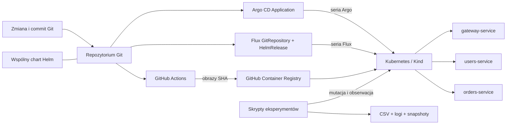

# Architektura

## Cel architektury

Projekt rozdziela płaszczyznę danych (trzy identycznie lekkie usługi HTTP) od
płaszczyzny sterowania (Argo CD albo Flux CD). Dzięki temu wynik eksperymentu
dotyczy procesu GitOps, a nie wydajności logiki biznesowej czy bazy danych.

W głównej serii badawczej tylko jedna z gałęzi `Argo`/`Flux` jest obecna na
klastrze. Diagram pokazuje oba możliwe przebiegi, nie jednoczesne zarządzanie tym
samym wydaniem.

## Warstwy

### Aplikacja

`gateway-service`, `users-service` i `orders-service` korzystają z jednej małej
fabryki FastAPI. Są niezależnymi procesami i obrazami. Gateway celowo nie wywołuje
pozostałych usług: zależności sieciowe oraz retry zmieniałyby czasy rolloutów i
utrudniały interpretację wyników. Nazwa wskazuje jedynie usługę wystawianą przez
opcjonalny Ingress.

### Dystrybucja

Każdy obraz jest budowany z kontekstu `app/`, uruchamiany jako UID/GID `10001` i
publikowany przez CI pod tagiem SHA commita. Wartości repozytorium obrazów w
charcie zawierają jawny placeholder, dopóki właściciel GHCR nie zostanie podany.

### Deklaracja Kubernetes

Jeden chart `helm/microservices-app` generuje dla każdej włączonej usługi:

- `ConfigMap` z konfiguracją procesu;
- `Deployment` z dwiema replikami, sondami, requests/limits i security context;
- `Service` typu `ClusterIP`;
- opcjonalnie jeden `Ingress` kierujący ruch do gatewaya.

Adnotacja `checksum/config` na szablonie poda wymusza kontrolowany rollout po
zmianie ConfigMapy. Etykiety `app.kubernetes.io/name` są stabilnym interfejsem dla
skryptów pomiarowych.

### Kontrolery GitOps

Argo CD używa `Application` z Helm source, `prune` i `selfHeal`. Flux używa
`GitRepository` oraz `HelmRelease` z `driftDetection.mode: enabled`. Oba źródła
wskazują katalog `helm/microservices-app` i nie mają kopii manifestów aplikacji.

Runner rozdziela dwa momenty obserwacji: reakcję publicznego statusu kontrolera
(`Application`, `GitRepository` albo `HelmRelease`) oraz recovery potwierdzone
stanem Deploymentu i endpointu. Korekta zasobu jest fallbackiem detekcji tylko
wtedy, gdy krótki status przejściowy nie trafi między odczyty pollingu.

## Izolacja i nazwy przestrzeni

Wariant pilotażowy może używać `test-argocd` oraz `test-fluxcd`, ale kontrolery
nadal konkurują wtedy o CPU/RAM pojedynczego węzła. Wariant referencyjny usuwa i
odtwarza klaster między pełnymi seriami. Zapewnia on czystsze porównanie i jest
zalecany do danych używanych w pracy.

## Bezpieczeństwo

- kontenery działają bez roota, bez eskalacji uprawnień i bez capabilities;
- główny system plików kontenera jest tylko do odczytu;
- token ServiceAccount nie jest automatycznie montowany do podów aplikacji;
- repozytorium nie zawiera tokenów, kubeconfigu ani danych logowania;
- dostęp do UI Argo odbywa się przez lokalny port-forward na `127.0.0.1`;
- obrazy do badań powinny używać niezmiennych tagów SHA, nie `latest`.

## Świadome uproszczenia

Nie ma bazy danych, kolejki, service mesh ani trwałych wolumenów. Metrics Server
służy jedynie do lekkiego próbkowania metryk i nie zastępuje systemu
monitoringu. Są to decyzje celowe: projekt ma izolować zachowanie kontrolera
GitOps, a każdy element powinien być możliwy do objaśnienia i odtworzenia.
